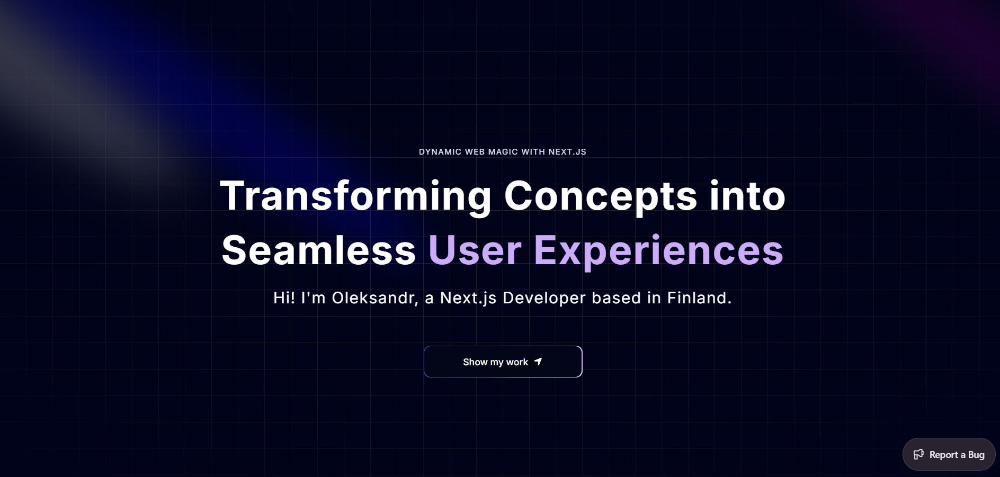
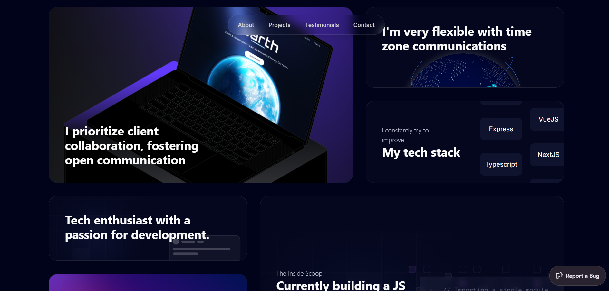

  

# 🚀 Personal Portfolio Website

🔗 **Live Demo:** [Visit Website](https://my-portfolio-beta-inky-11.vercel.app/)

A modern, responsive personal portfolio built with Next.js, TypeScript, Tailwind CSS, and Aceternity UI.
This project was originally developed by following a tutorial from JavaScript Mastery, but has been significantly refactored, customized, and improved to reflect my own style and development approach.

## 📸 Preview

  
  

## 🎯 Overview

This portfolio serves as a personal developer website to showcase my projects, skills, and experience in a clean and interactive way.

While the foundation was based on a tutorial, the final version is heavily modified with custom design decisions, bug fixes, and additional improvements to make it feel like a real production-ready portfolio rather than a tutorial project.

## ⚙️ Key Improvements

Compared to the original tutorial project, this version includes:

- 🛠️ Fixed multiple bugs and inconsistencies from the original implementation
- 🧹 Refactored code structure for better scalability and maintainability
- 🎨 Fully customized UI and layout to match my personal style
- ✨ Improved responsiveness and user experience across devices
- ⚡ Enhanced component structure and readability
- 🧩 Added personal adjustments and design refinements beyond the tutorial scope

## 🧠 Purpose

This project was built to demonstrate:

- Strong understanding of modern frontend development
- Ability to work with Next.js and TypeScript in real-world projects
- UI/UX design sense and attention to detail
- Capability to improve and extend existing codebases
- Portfolio-level production thinking beyond tutorial work
  
## 🛠️ Tech Stack
- ⚡ Next.js
- 💙 TypeScript
- 🎨 Tailwind CSS
- 🧩 Aceternity UI
- 🚀 Vercel
- ❌ Sentry

## 📌 Features
- Fully responsive design (mobile-first)
- Smooth animations and modern UI interactions
- Project showcase section
- About / skills section
- Contact section
- Clean, minimal, and developer-focused layout

## 💡 Note

This project is based on a tutorial by JavaScript Mastery, but has been heavily modified, improved, and personalized.
The goal was to go beyond copying and instead turn it into a real portfolio that represents my own identity as a developer.

## 🧠 What I Learned

- Building scalable React/Next.js architecture
- Improving existing codebases beyond tutorials
- UI/UX thinking in real projects
- Working with component-driven design systems

## 🚀 Result

A polished, modern portfolio that demonstrates not only frontend development skills, but also the ability to refine, redesign, and elevate existing projects into something unique and production-ready.

## 🚀 Impact

This project helped me transition from tutorial-based learning to building and customizing real-world frontend applications with a focus on UI/UX and scalability.

  
  

  Built with ❤️ using Next.js

